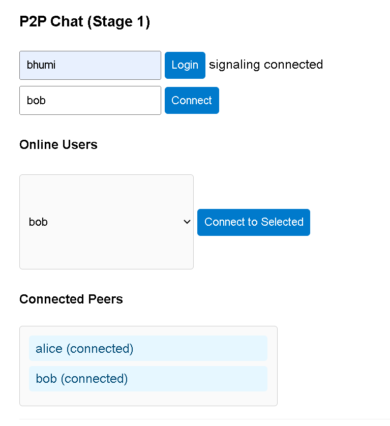
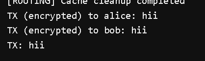

# P2P Encrypted Chat

A browser-based peer-to-peer chat prototype with a Python signaling server. The app lets users log in with a username, discover online peers, establish WebRTC data channels, and exchange encrypted messages using libsodium.

## Project Overview

This project demonstrates a hybrid chat architecture:

- A FastAPI server handles login, online user discovery, WebSocket signaling, and fallback message routing.
- Browser clients use WebRTC data channels for direct peer-to-peer communication.
- Client-side cryptography creates local identities, performs a signed handshake, derives session keys, and encrypts messages before sending them over the data channel.
- Routing helpers add message IDs, TTL checks, duplicate suppression, path tracking, peer relay attempts, and offline queue support.

The goal is to explore secure P2P messaging with a lightweight backend that coordinates peers without carrying every chat message during normal direct delivery.

## Features

- Username-based login.
- Live online user list.
- Connect-to-selected-peer workflow.
- WebRTC offer, answer, and ICE candidate signaling.
- P2P data channel messaging.
- Ed25519 identity keys stored per browser username.
- Signed ephemeral key exchange.
- Encrypted message packets using libsodium secretbox.
- Replay protection with message counters.
- Connected peer list in the UI.
- Routed message metadata with unique IDs, TTL, path tracking, and duplicate suppression.
- Server-side offline queue for routed messages.
- Server stats endpoint at `/stats`.

## Architecture

```text
Browser Client A                  FastAPI Server                  Browser Client B
----------------                  --------------                  ----------------
index.html                        main.py                         index.html
app.js             WebSocket      WebSocket endpoint              app.js
messageRouter.js  <----------->   signaling relay   <-----------> messageRouter.js
      |                            message queue                         |
      |                                                                  |
      +---------------------- WebRTC Data Channel -----------------------+
                         encrypted P2P messages
```

The server is responsible for coordination:

- Tracks connected users.
- Broadcasts online user lists.
- Relays WebRTC signaling messages.
- Validates routed messages.
- Queues routed messages for offline users.

The client is responsible for communication and encryption:

- Creates and stores local identity keys.
- Establishes WebRTC peer connections.
- Performs the cryptographic handshake.
- Encrypts and decrypts chat messages.
- Attempts peer relay for routed messages.

For deeper details, see [docs/ARCHITECTURE.md](docs/ARCHITECTURE.md) and [docs/MESSAGE_ROUTING_GUIDE.md](docs/MESSAGE_ROUTING_GUIDE.md).

## Tech Stack

| Layer | Technology |
| --- | --- |
| Frontend | HTML, CSS, JavaScript |
| Frontend dev server | Vite |
| P2P transport | WebRTC DataChannel |
| Signaling transport | WebSocket |
| Backend | Python, FastAPI |
| Backend server | Uvicorn |
| Cryptography | libsodium-wrappers |
| Package management | npm, pip |

## Folder Structure

```text
D:\torrent
|-- assets
|   |-- login.png
|   `-- chat_sent.png
|-- client
|   |-- index.html
|   |-- app.js
|   `-- messageRouter.js
|-- server
|   |-- main.py
|   |-- message_routing.py
|   `-- requirements.txt
|-- docs
|   |-- QUICK_START.md
|   |-- ARCHITECTURE.md
|   |-- MESSAGE_ROUTING_GUIDE.md
|   |-- TROUBLESHOOTING.md
|   `-- other reference docs
|-- package.json
|-- package-lock.json
|-- .gitignore
`-- README.md
```

## Installation

Install the frontend dependencies:

```powershell
cd D:\torrent
npm install
```

Create and activate a Python virtual environment:

```powershell
cd D:\torrent
python -m venv .venv
.\.venv\Scripts\Activate.ps1
```

Install the backend dependencies:

```powershell
cd D:\torrent\server
pip install -r requirements.txt
```

## Running the Project

Start the FastAPI signaling server:

```powershell
cd D:\torrent\server
python -m uvicorn main:app --reload
```

Start the Vite frontend server in a second terminal:

```powershell
cd D:\torrent
npm run dev
```

Open the frontend:

```text
http://localhost:5173
```

Open two browser windows or profiles, log in with different usernames, connect one user to the other, and send a message.

Backend status is available at:

```text
http://localhost:8000/stats
```

## Screenshots

### Login



### Message Sent



## Future Work

- Add persistent user accounts instead of local demo usernames.
- Store offline queued messages in a database.
- Add message history in the UI.
- Add file transfer over WebRTC data channels.
- Improve the UI layout and mobile responsiveness.
- Add automated tests for routing and message validation.
- Add TURN server support for harder NAT/firewall cases.
- Add production configuration for CORS, HTTPS, and secure WebSocket URLs.
- Replace demo identity trust with a stronger verification model.

## More Documentation

- [Quick Start](docs/QUICK_START.md)
- [Architecture](docs/ARCHITECTURE.md)
- [Troubleshooting](docs/TROUBLESHOOTING.md)
- [Quick Reference](docs/QUICK_REFERENCE.md)
